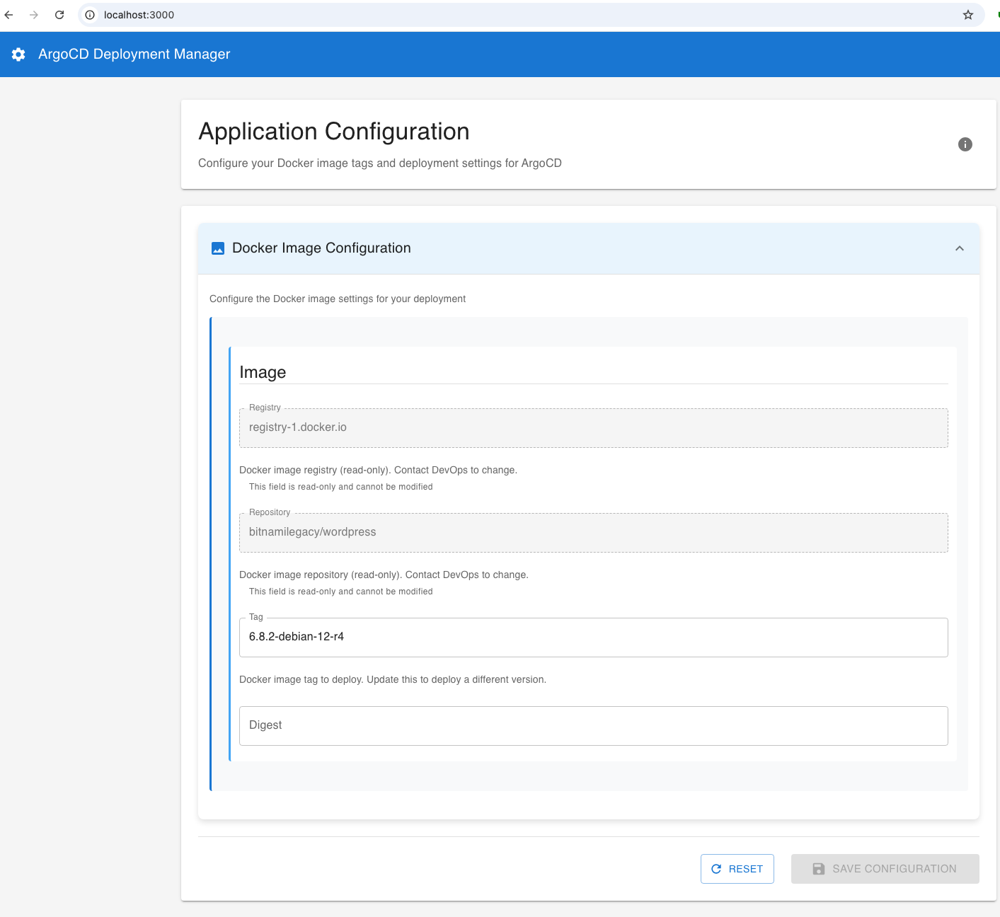
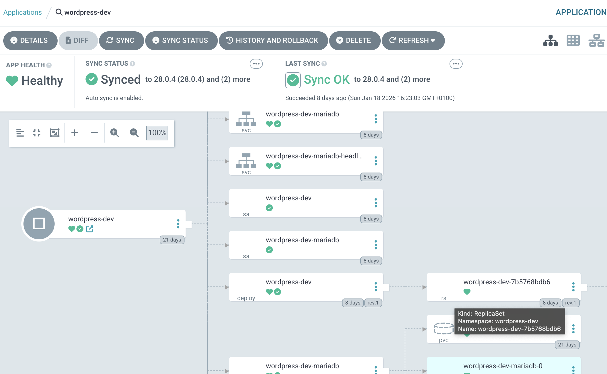

# Helm UI - Dynamic Configuration Manager for ArgoCD

A configuration-driven web UI for managing Helm values and deploying Docker images via ArgoCD. This project automatically generates user-friendly forms from your `values.yaml` file with full Git integration and customization through a simple configuration file. The goal is to provide simple interface for developers and DevOps teams to manage Helm chart values without needing to edit YAML files directly. Aligned with ArgoCD, one can split the `values.yaml` and provide a self-service UI for developers to update image tags and other deployment settings.

## Features

### Core Features
- **Fully Dynamic UI**: Automatically generates forms from any `values.yaml` file
- **No Code Required**: Customize behavior through `config.yaml` without touching code
- **Read-Only Fields**: Protect critical infrastructure values
- **Organized Sections**: Group related fields with collapsible accordions
- **Field Descriptions**: Add helpful context to any field

### Git Integration
- **Automatic Sync**: Pull latest changes on page refresh/reload
- **Auto Push**: Commit and push changes automatically on save
- **SSH & Token Auth**: Supports both SSH keys and personal access tokens
- **Configurable**: Full control over Git operations via config.yaml

### Smart Change Detection
- **Change Tracking**: Detects modifications from original configuration
- **Disabled Save Button**: Prevents saving when no changes are made
- **Visual Diff Viewer**: See exactly what changed before confirming
- **Highlighted Fields**: Changed field names displayed in bold with old → new comparison
- **Change Counter**: Shows number of modified fields

### Safety & Validation
- **Confirmation Dialogs**: Review changes before saving with visual diff
- **Real-time Validation**: Form validation with visual feedback
- **Server-side Enforcement**: Read-only fields protected at API level

## Architecture

```
┌──────────────┐
│ Git Repository│◀──────────────┐
│  values.yaml  │               │
└──────┬───────┘                │
       │ Pull on Refresh   Push on Save
       ▼                         │
┌─────────────┐   ┌──────────┐  │  ┌────────────┐
│ config.yaml │──▶│  Backend │──┼─▶│  Frontend  │
└─────────────┘   │ (FastAPI)│  │  │  (React)   │
                  │+ Git Helper│──┘  │+ Diff View │
                  └──────────┘       └────────────┘
                       │
                  JSON Schema
                  + Metadata
```

## Prerequisites

- **Python 3.8+**
- **Node.js 16+**
- **npm or yarn**

## Quick Start

### 1. Clone the Repository

```bash
git clone <your-repo-url>
cd helm-ui-project
```

### 2. Setup Backend

```bash
# Create and activate virtual environment
python -m venv venv
source venv/bin/activate  # On Windows: venv\Scripts\activate

# Install dependencies
cd backend
pip install -r requirements.txt

# Start the backend server
python main.py
```

Backend runs on `http://127.0.0.1:8000`

### 3. Setup Frontend

```bash
# In a new terminal
cd frontend
npm install

# Start the development server
npm start
```

Frontend runs on `http://localhost:3000`

### 4. Access the UI

Open your browser to `http://localhost:3000`

## Configuration

### Customize for Your Project

The entire UI behavior is controlled by `backend/config.yaml`. No code changes needed!

#### Example Configuration

```yaml
# Mark fields as read-only
readonly_fields:
  - image.repository
  - image.pullPolicy
  - ingress.host

# Convert arrays to selectable options
enum_fields:
  - environments
  - branches

# Add helpful descriptions
field_descriptions:
  image.tag: "Docker image tag to deploy. Update this to deploy a different version."
  service.port: "Port number for the Kubernetes service."

# Organize fields into sections
sections:
  - key: image
    title: "Docker Image Configuration"
    description: "Configure the Docker image settings for your deployment"
    icon: "image"

  - key: service
    title: "Service Configuration"
    description: "Configure Kubernetes service settings"
    icon: "cloud"

# UI settings
ui_config:
  title: "ArgoCD Deployment Manager"
  description: "Configure your Docker image tags and deployment settings for ArgoCD"
  confirm_before_save: true
  show_json_toggle: true
```

See `backend/README.md` for complete configuration documentation.

### Git Integration Setup

Enable Git integration to automatically sync changes with your repository.

#### SSH Authentication (Recommended)

```yaml
git_config:
  enabled: true
  repo_url: "git@github.com:username/repo.git"
  branch: "main"
  values_path: "values.yaml"  # Path within the repo
  local_path: "./git-repo"     # Local clone directory

  # Git author information
  author_name: "Helm UI Bot"
  author_email: "helm-ui@example.com"

  # Authentication
  auth:
    method: "ssh"
    ssh_key_path: "~/.ssh/id_rsa"  # Path to your SSH private key

  # Auto-sync options
  auto_pull_on_start: true   # Pull when backend starts
  auto_push_on_update: true  # Push after save
```

#### Token Authentication (HTTPS)

```yaml
git_config:
  enabled: true
  repo_url: "https://github.com/username/repo.git"
  branch: "main"

  auth:
    method: "token"
    token: "ghp_your_github_personal_access_token"  # GitHub PAT
```

**How it works:**
- **On page load/refresh**: Automatically pulls latest changes from Git
- **On save**: Commits changes and pushes to remote repository
- **No manual Git operations needed**: Everything happens automatically

## Project Structure

```
helm-ui-project/
├── backend/
│   ├── main.py              # FastAPI backend
│   ├── git_helper.py        # Git operations handler
│   ├── config.yaml          # UI configuration (customize this!)
│   ├── requirements.txt     # Python dependencies
│   ├── README.md            # Backend documentation
│   └── git-repo/            # Local Git clone (created automatically)
├── frontend/
│   ├── src/
│   │   ├── App.js           # Main React component with diff viewer
│   │   ├── App.css          # Styling
│   │   └── index.js         # React entry point
│   ├── public/
│   │   └── index.html       # HTML template
│   ├── package.json         # Node dependencies
│   └── .env.example         # Environment variables template
├── values.yaml              # Helm values file (or use from git-repo)
└── README.md                # This file
```

## API Endpoints

| Endpoint | Method | Description |
|----------|--------|-------------|
| `/schema` | GET | Returns JSON Schema with UI metadata |
| `/values` | GET | Returns current values from `values.yaml` |
| `/update` | POST | Updates `values.yaml` (respects read-only fields) |
| `/config` | GET | Returns current configuration |
| `/reload-config` | POST | Reloads `config.yaml` without restart |

## Adapting to Your Helm Chart

1. **Replace `values.yaml`** with your Helm chart's values file
2. **Edit `backend/config.yaml`** to specify:
   - Which fields should be read-only
   - Which fields should be dropdowns
   - Field descriptions
   - How to organize sections
3. **Restart the backend** - UI updates automatically!

No code changes required!

## Screenshots

### collapsible Sections 1


### collapsible Sections 2


### Integration with ArgoCD


### Sample argo-cd Application YAML
```yaml
apiVersion: argoproj.io/v1alpha1
kind: Application
metadata:
  name: wordpress-dev
  namespace: argocd
spec:
  project: default
  sources:
    - repoURL: registry-1.docker.io/bitnamicharts
      chart: wordpress
      targetRevision: 28.0.4
      helm:
        releaseName: wordpress-dev
        valueFiles:
          - $values/argo-apps/dev/values/wordpress.yaml     # Main values file
          - $imagetagvalues/wordpress-dev.yaml              # A different repo for image tag overrides
    - repoURL: "https://github.com/smarty24/homelab.git"
      targetRevision: HEAD
      ref: values
    - repoURL: "https://github.com/kelechi-onyia/helm-value-files.git" 
      targetRevision: HEAD
      ref: imagetagvalues

  destination:
    server: https://kubernetes.default.svc
    namespace: wordpress-dev
  syncPolicy:
    retry:
      backoff:
        duration: 5s
        factor: 2
        maxDuration: 3m0s
      limit: 5
    automated:
      prune: true
      selfHeal: true
    syncOptions:
      - CreateNamespace=true
```

## Development

### Backend Development

```bash
cd backend
source ../venv/bin/activate
python main.py

# Backend runs on http://127.0.0.1:8000
# API docs at http://127.0.0.1:8000/docs
```

### Frontend Development

```bash
cd frontend
npm start

# Frontend runs on http://localhost:3000
# Hot reload enabled
```

### Reload Configuration

After editing `config.yaml`:

```bash
curl -X POST http://127.0.0.1:8000/reload-config
```

Or click the refresh button in the UI.

## Environment Variables

### Backend

Edit `backend/main.py` or set environment variables:

- `VALUES_FILE`: Path to values.yaml (default: `../values.yaml`)
- `CONFIG_FILE`: Path to config.yaml (default: `config.yaml`)

### Frontend

Create `frontend/.env`:

```bash
REACT_APP_API_URL=http://127.0.0.1:8000
```

## Technologies Used

### Backend
- **FastAPI**: Modern Python web framework
- **PyYAML**: YAML parsing
- **GitPython**: Git operations and automation
- **Uvicorn**: ASGI server
- **Pydantic**: Data validation

### Frontend
- **React 19**: UI library
- **Material-UI v5**: Component library with Emotion styling
- **@rjsf/mui**: JSON Schema Form with Material-UI theming
- **Axios**: HTTP client for API calls

## Security

- Read-only fields are enforced server-side
- Enum fields prevent arbitrary values
- CORS protection
- Input validation via JSON Schema

>[!IMPORTANT] Security Notice
> More emphasis should be placed on securing the UI and backend communication.

## Deployment

### Docker Deployment (Recommended)

#### Quick Start with Docker

1. **Copy environment configuration:**
   ```bash
   cp .env.example .env
   ```

2. **Edit `.env` file with your settings:**
   ```bash
   # Update Git repository URL
   GIT_REPO_URL=git@github.com:username/repo.git

   # Configure authentication
   GIT_AUTH_METHOD=ssh
   GIT_SSH_KEY_PATH=~/.ssh/id_rsa

   # Or use token auth
   # GIT_AUTH_METHOD=token
   # GIT_TOKEN=ghp_your_token_here
   ```

3. **Build and start containers:**
   ```bash
   docker-compose up -d
   ```

4. **Access the application:**
   - Frontend: http://localhost:3000
   - Backend API: http://localhost:8000
   - API Documentation: http://localhost:8000/docs

#### Docker Commands

```bash
# Start services
docker-compose up -d

# View logs
docker-compose logs -f

# Stop services
docker-compose down

# Rebuild after code changes
docker-compose up -d --build

# View running containers
docker ps
```

#### Environment Variable Configuration

The application supports full configuration via environment variables, which override `config.yaml` settings:

**Git Configuration:**
- `GIT_ENABLED` - Enable/disable Git integration (true/false)
- `GIT_REPO_URL` - Git repository URL
- `GIT_BRANCH` - Branch to use (default: main)
- `GIT_VALUES_PATH` - Path to values.yaml in repo
- `GIT_LOCAL_PATH` - Local clone directory
- `GIT_AUTHOR_NAME` - Commit author name
- `GIT_AUTHOR_EMAIL` - Commit author email
- `GIT_AUTH_METHOD` - Authentication method (ssh/token)
- `GIT_SSH_KEY_PATH` - Path to SSH private key
- `GIT_TOKEN` - Personal access token (for HTTPS)
- `GIT_AUTO_PULL_ON_START` - Auto-pull on startup
- `GIT_AUTO_PUSH_ON_UPDATE` - Auto-push on save

See `.env.example` for complete configuration options and examples.

#### SSH Key Setup for Docker

When using SSH authentication with Docker:

1. **Ensure SSH keys exist:**
   ```bash
   ls -la ~/.ssh/id_rsa
   ```

2. **Set correct permissions:**
   ```bash
   chmod 600 ~/.ssh/id_rsa
   chmod 644 ~/.ssh/id_rsa.pub
   ```

3. **The docker-compose.yml automatically mounts ~/.ssh directory** as read-only
   - To use a different SSH key, update `SSH_KEY_PATH` in `.env`

4. **Test SSH connection to your Git provider:**
   ```bash
   ssh -T git@github.com
   ```

### Build (Without Docker)

```bash
# Backend
cd backend
pip install -r requirements.txt
uvicorn main:app --host 0.0.0.0 --port 8000

# Frontend
cd frontend
npm run build
# Serve the build folder with nginx or similar
```

### Deployment Best Practices

1. **Use environment variables** for all sensitive configuration (tokens, SSH keys)
2. **Mount persistent volumes** for Git repositories to preserve clones between restarts
3. **Set up reverse proxy** (nginx/traefik) for SSL/TLS termination
4. **Configure health checks** for container orchestration
5. **Use secrets management** (Docker secrets, Kubernetes secrets) for tokens
6. **Set resource limits** in docker-compose.yml for production workloads

## Troubleshooting

### Backend won't start
- Check Python version: `python --version` (need 3.8+)
- Ensure virtual environment is activated
- Verify `values.yaml` exists and is valid YAML

### Frontend won't start
- Check Node version: `node --version` (need 16+)
- Delete `node_modules` and run `npm install` again
- Check for port conflicts on 3000

### Changes not appearing
- Refresh the page
- Check browser console for errors
- Verify `config.yaml` is valid YAML
- Use `/reload-config` endpoint

### Read-only fields not working
- Check field path in `config.yaml` (use dot notation: `image.repository`)
- Verify field exists in `values.yaml`
- Check backend logs

### Git integration issues
- **Clone fails**:
  - Verify `repo_url` is correct in `config.yaml`
  - Check SSH key permissions: `chmod 600 ~/.ssh/id_rsa`
  - Test SSH connection: `ssh -T git@github.com`
  - For token auth, verify token has repo permissions
- **Push fails**:
  - Check Git credentials are valid
  - Verify branch exists on remote
  - Check SSH key has write access
  - Review backend logs for detailed error messages
- **Changes not syncing**:
  - Verify `auto_pull_on_start` and `auto_push_on_update` are `true`
  - Check `values_path` matches file location in repo
  - Ensure `local_path` directory is writable

## Contributing

Contributions welcome! Please:

1. Fork the repository
2. Create a feature branch
3. Make your changes
4. Submit a pull request

## License

MIT License - feel free to use this in your projects!

## Roadmap

### Completed Features
- [x] Git integration (clone, pull, push)
- [x] Automatic sync on refresh and save
- [x] Visual diff view before save
- [x] Change detection and tracking
- [x] SSH and token authentication
- [x] Docker containerization with docker-compose
- [x] Environment variable configuration

### Planned Features
- [ ] Authentication/Authorization - Maybe OAuth2-Proxy or similar
- [ ] Multi-file support (edit multiple values files)
- [ ] Version history/rollback (Git commit history viewer)
- [ ] Advanced field validation rules (regex, min/max)
- [ ] Conditional fields (show/hide based on other values)
- [ ] Custom widgets (date picker, color picker)
- [ ] Export/Import configurations
- [ ] Real-time collaboration
- [ ] Webhook integrations for ArgoCD sync

## Support

For issues or questions:
- Check `backend/README.md` for configuration details
- Review API docs at `http://127.0.0.1:8000/docs`
- Open an issue on GitHub

## Acknowledgments

Built with:
- React JSON Schema Form (@rjsf)
- Material-UI
- FastAPI
- The amazing open-source community

---

**Made with ❤️ for DevOps teams managing Helm deployments**
